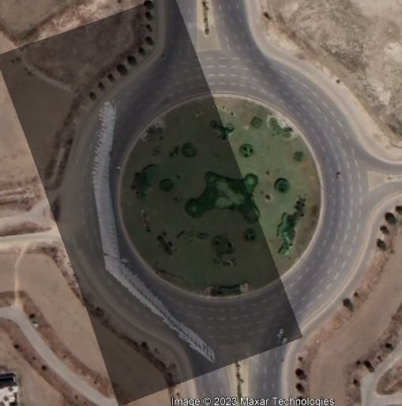

# Road-Plane Top-View Panorama from Dashcam Video

Reconstructs a bird's-eye-view map of a road from a single forward-facing dashcam
video, and overlays it onto satellite imagery.

Each frame is segmented to isolate the road surface, warped into the top-view plane
by homography, and composited into a growing panorama. Detected vehicles are
projected into the same plane as position markers.



---

## Pipeline

```
  dashcam video
       │
       ├─── frame extraction ──────────────────────────────┐
       │                                                    │
       ▼                                                    ▼
  ┌──────────────┐                                  ┌───────────────┐
  │  HybridNets  │  road + lane segmentation        │   SuperGlue   │
  │              │  vehicle detection (cars)        │  feature match│
  └──────┬───────┘                                  └───────┬───────┘
         │ binary road mask                                 │ correspondences
         │ car bounding boxes                               │ between frames
         │                                                  ▼
         │                                        ┌──────────────────┐
         │                                        │ findHomography   │
         │                                        │  frame n → n-1   │
         │                                        └────────┬─────────┘
         │                                                 │
         ▼                                                 ▼
  ┌────────────────────────────────────────────────────────────────┐
  │  warpPerspective into top-view plane, masked to road pixels     │
  │  vehicle bbox base midpoint → perspectiveTransform → marker     │
  └────────────────────────────┬───────────────────────────────────┘
                               ▼
                    panorama composition
                               ▼
                 overlay on satellite image
```

**Road segmentation.** [HybridNets](https://github.com/datvuthanh/HybridNets) produces
road and lane segmentation plus vehicle detection in one pass. Road and lane classes
are merged into a single mask; everything else goes to zero, so only the road plane
is carried into the panorama.

**Frame-to-frame correspondence.** [SuperGlue](https://github.com/magicleap/SuperGluePretrainedNetwork)
matches keypoints between successive frames. Restricting matches to points lying on
the road plane matters here — a homography is only valid for a planar surface, so
including buildings and signage biases the estimate. (This was the main improvement
noted over the earlier iteration.)

**Top-view projection.** A reference homography `h1t` maps the first frame into the
satellite/top-view plane. Per-frame homographies chain onto it to bring later frames
into the same plane.

**Vehicle localization.** For each detected car, the midpoint of the bounding box
base approximates the tyre contact patch — the point where the vehicle actually meets
the road plane, and therefore the only point on the box the road homography maps
correctly. That point is projected into top-view and drawn as a marker.

## Repository layout

```
notebooks/pipeline.ipynb   Full pipeline
src/topview.py             Projection and composition logic
tests/test_topview.py      Test suite
assets/overlay.jpg         Result: panorama over satellite imagery
docs/METHOD.md             Method write-up
```

## Running it

The notebook is written for Google Colab with Drive mounted. Set the paths in the
configuration cell at the top:

```python
BASE      = '/content/drive/MyDrive/final'
SUPERGLUE = '/content/drive/MyDrive/CVProject/superglue'
VIDEO     = f'{BASE}/1.mp4'
```

External dependencies, cloned separately:

- [HybridNets](https://github.com/datvuthanh/HybridNets) — with `weights/hybridnets.pth`
- [SuperGlue](https://github.com/magicleap/SuperGluePretrainedNetwork) — for `match_pairs.py`

Then run cells in order: frame extraction → SuperGlue matching → per-frame warping →
panorama composition.

## Implementation notes

Three decisions that matter for correctness, each covered by regression tests.

### 1. The homography must accumulate

The tempting shortcut is:

```python
hom = np.dot(h1t, H)     # H is only frame n -> n-1
```

This rebuilds the transform from the fixed reference `h1t` on every iteration
instead of chaining onto the previous result, so every frame maps to the *same*
top-view coordinate — the projection never advances along the road. Projecting a
fixed road point under constant forward motion:

| frame | non-accumulating | correct |
| --- | --- | --- |
| 1 | (250.6, 309.9) | (250.6, 309.9) |
| 3 | (250.6, 309.9) | (252.1, 315.6) |
| 5 | (250.6, 309.9) | (253.1, 319.6) |
| 8 | (250.6, 309.9) | (254.1, 323.6) |

The corrected form carries a running product:

```python
cumulative = cumulative @ H
top_view   = h1t @ cumulative
```

### 2. Panorama placement is geometric, not hand-tuned

Positioning frames with hardcoded offsets and index-range branches only works for
one specific video. With a correct chain it is also unnecessary: the canvas extent
is computed by projecting each frame's corners through its homography, taking the bounding box,
and translating it to the origin — so placement follows from the geometry.

### 3. Homography estimation uses RANSAC

`cv2.findHomography` defaults to least-squares over *all* correspondences, so a
single bad match skews the fit — a real risk when matching a moving scene with
vehicles and off-plane structure. This uses `cv2.RANSAC` with a 5.0px threshold and
reports the inlier count per frame. A regression test corrupts 10 of 60
correspondences and asserts the estimate still recovers the true transform.

## Tests

```bash
pip install -r requirements.txt
python -m pytest tests/ -v
```

12 tests, no external data required — they use synthetic homographies, so they run
without the video, SuperGlue outputs, or HybridNets weights.

The tests are written to catch the bug described above: reintroducing a
non-accumulating homography breaks `test_projection_advances_across_frames`,
`test_motion_is_monotonic`, and `test_chain_equals_explicit_product`.

## Remaining limitations

- **Drift is uncorrected.** Chained homographies accumulate error over long
  sequences with no loop closure or bundle adjustment, so alignment degrades the
  further the vehicle travels.
- **Index alignment.** The loop reads `npz_files[imgSet]` while loading images at
  `ind = imgSet + 1`; worth verifying against SuperGlue's output naming for a new
  dataset.
- **Planarity assumption.** A homography is only valid for a planar surface, so
  inclines, crests, and camber introduce error the model cannot represent.

## Author

Sana Hassan — implementation.

Built as a computer vision course project with Hammad Javed, who contributed to
the project outside the codebase.

## Acknowledgements

- [HybridNets](https://github.com/datvuthanh/HybridNets) — segmentation and detection
- [SuperGlue](https://github.com/magicleap/SuperGluePretrainedNetwork) — feature matching
- Panorama stitching approach adapted from
  [bimalka98/Stitch-images-using-SuperGlue-GNN](https://github.com/bimalka98/Stitch-images-using-SuperGlue-GNN)
- Satellite imagery © 2023 Maxar Technologies

## License

MIT — see [LICENSE](LICENSE).
